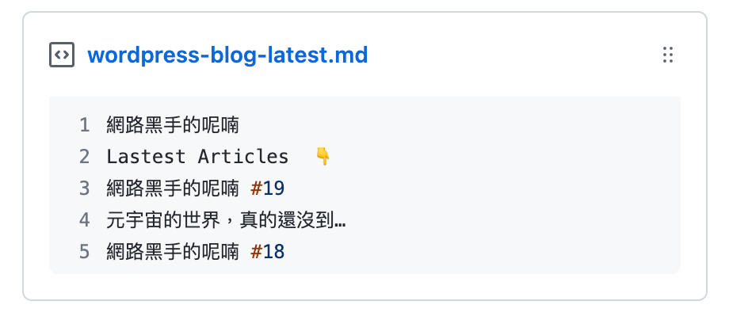

# wordpress-post-box

This project is an experimental test for pinned gists and heavily inspired by
[medium-stat-box](https://github.com/kylemocode/medium-stat-box) and
[awesome-pinned-gists](https://github.com/matchai/awesome-pinned-gists).

It will fetch the latest posts from the WordPress blog through its RSS and show
it on the given Gist so you can pin the posts on your Github profile easily.

## HowTo

You just need to folk this project and provide three necessary env to the
**Actions**.

- GIST_ID: The Gist ID you want to save the posts.
- GH_TOKEN: The access token of the updated permission to the Gist, you can
  gererate the token in your [Github settings](https://github.com/settings/).
- WP_RSS_LINK: WordPress RSS link. (e.g,, The format of the WordPress.com blog
  would be https://URL.wordpress.com/feed/)
